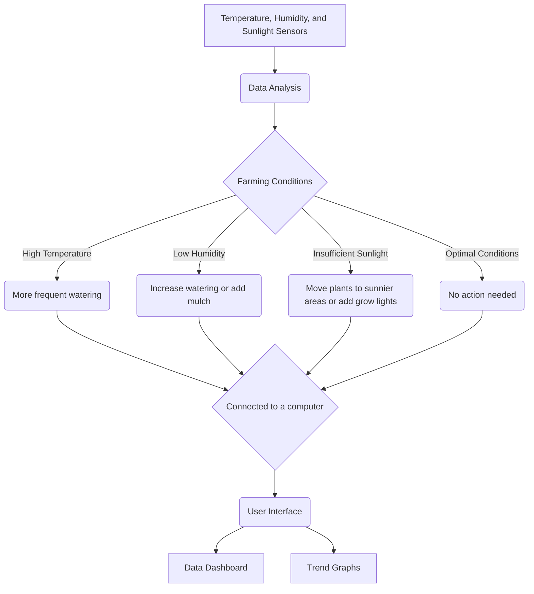

# AgriMapBot 🌾

 
 

## Table of Contents

[Introduction](#introduction)

 1. [The Problem We’re Solving](#the-problem-were-solving) 
    - [Inconsistent Crop Yields](#inconsistent-crop-yields)
    - [Resource Management](#resource-management)
    - [Pest and Disease Control](#pest-and-disease-control)
 2. [How the System Works](#how-the-system-works)
 3. [Key Features and Benefits](#key-features-and-benefits)
 4. [Technical Specifications](#technical-specifications) 
    - [Capacity](#capacity)
    - [Fuel Sources](#fuel-sources)
    - [Efficiency](#efficiency)
 5. [Obstacles and Potential Problems](#obstacles-and-potential-problems) 
    - [Connectivity Issues](#connectivity-issues)
    - [Extreme Weather Conditions](#extreme-weather-conditions)
    - [Maintenance and Repair](#maintenance-and-repair)
 6. [Possible Solutions](#possible-solutions)
 7. [Competitive Advantages](#competitive-advantages)
 8. [Potential Applications or Uses](#potential-applications-or-uses)
 9. [Budget](#budget)
10. [Follow Up (After-Sales Services)](#follow-up-after-sales-services)
11. [Examples (Images / 3D Models)](#examples-images-3d-models)

[Conclusion](#conclusion)

 
 
 
 

# Introducing AgriMapBot - Your personalized Farming Advisor

Agriculture is a huge sector of the global economy and plays an important role in the food industry by guaranteeing food security. What we can notice is that, since a few years after the beginning of the industrial era, agriculture has had to endure lots of vagaries and hazards that have impacted crop yields and overall productivity. \
    Inconsistent weather patterns, diseases, and resource mismanagement have all contributed to these challenges. \
    It is here that these challenges meet AgriMapBot, a simple robot that aims to provide practical answers to these various problems. It is meant to enhance yields, optimize resource usage, and give personal advice to the user. \
    It is important to note that while this project draws inspiration from other successful initiatives such as FarmBot and EcoRobotix, which have made significant strides in precision farming and autonomous weeding, AgriMapBot distinguishes itself through its unique features and tailored applications for larger agricultural fields. \
    In this document, we will explore the various aspects of AgriMapBot, including the problems it addresses, how it works, its key features and benefits, technical specifications, potential challenges and solutions, competitive advantages, applications, budget considerations, and follow-up services. By the end of this document, you will have a comprehensive understanding of how this robot can transform agricultural management, especially in regions with challenging environments such as those found across the African continent.

---

## The Problem We’re Solving

Agriculture, the most vital industry in the global economy, faces numerous problems that can hinder productivity. Climate change is the biggest one, it has made it challenging to determine the optimal time for planting and harvesting crops, resulting in crop failure in many cases. This is exacerbated by Africa's severe water deficit, making effective water management techniques crucial for irrigation. But what we tend to usually forget is the poor resource management - including water and fertilizers - which is a leading factor affecting agriculture. And environmental degradation, particularly soil erosion is linked to it. Excessive use of chemical fertilizers and pesticides has diminished soil fertility and productivity.\
     Labor shortages also pose operational difficulties, which can be minimized through automation and providing guidance to farmers for more critical tasks. Furthermore, many farmers do not embrace modern farming technologies that could enhance productivity and sustainability.\
    Unfortunately, we currently cannot address the economic aspect of starting a farm. Small-scale farmers in Africa face the challenge of high input costs for seeds, fertilizers, and pesticides, which greatly affects them.\
    However, leveraging technology enhances efficiency, sustainability, and economic outcomes, and might announce a brighter future for farming.

## How the System Works

AgriMapBot 🌾 works with a variety of sensors that measure environmental conditions. These sensors measure the ambient temperature and the level of humidity in different parts of the field. The collected data have for goal, the understanding of the microclimates within the field. Humidity levels can affect plant health, pest populations and the spread of disease. We also used a photoresistance as a sunlight measurement sensor. By measuring the voltage across its terminals, the microcontroller determines the intensity of sunlight, which is essential for understanding the photosynthetic activity and growth conditions of the crops.\
    The robot  is completely autonomous, it does not need human supervision. It utilizes its GPS navigation system for accurate movement, precise field location determination, and complete area coverage without any omissions. To navigate safely, the bot is equipped with ultrasonic sensors. These sensors detect objects in the robot's path so that it can avoid collisions by changing its itinerary accordingly.\
    Once the robot is operating, it continuously collects data from its sensors. These sensors measure the temperature and humidity values at various points near the ground, thanks to the low height of its chassis. This data is collected based on its georeference and timestamp, meaning that each data point is labeled with the exact time and location of its collection. The collected data is processed and analyzed using advanced AI algorithms to identify patterns and anomalies. This process can help to detect areas of the field that are consistently drier or warmer than others, which may indicate irrigation or soil quality problems.

    By utilizing the data processing capabilities, AgriMapBot 🌾 generates detailed field maps, visually representing temperature and humidity variations. This enables the identification of areas requiring special attention, such as those with low humidity levels or high temperatures that may negatively impact crops. \
    Through data analysis, the system offers personalized recommendations aimed at maximizing crop health and yield. The algorithm provides guidance on optimal irrigation placement and quantity to achieve uniform moisture distribution. Additionally, farmers receive alerts regarding potential pest infestations or disease outbreaks, along with nutrient application recommendations based on identified deficiencies in various field areas.

    All information and recommendations generated by AgriMapBot 🌾 are made accessible via a mobile application. The application provides interactive maps that farmers can zoom in and explore for detailed information on specific areas of their fields. It sends alerts and notifications on critical issues requiring immediate attention. Farmers can monitor the robot's progress and view real-time data as it navigates the field. They can access historical data to track changes and improvements of his field over time.

 

## Key Features and Benefits

The AgriMapBot boasts several key features, making it an indispensable tool for agricultural management. Initially, the system produces intricate maps of fields, showcasing variations in temperature, humidity, and light. This enables farmers to create detailed field maps and receive tailored recommendations for optimal irrigation, as well as the necessary nutrients and fertilizers for the best yields. These capabilities are instrumental in enhancing crop health and productivity while minimizing fertilizer usage. Furthermore, all data and advice are readily available via a mobile app, which permits farmers to monitor the robot's progress, observe real-time data, and note changes and advancements over time. This facilitates effective and efficient farm management, revolutionizing agricultural methods and boosting crop productivity by aiding farmers in making well-informed decisions and keeping track of the robot's real-time progress.

Based on the data collected in the field, the AgriMapBot will also give advice on the most appropriate types of seeds, how to maintain them and, if necessary, how to protect them from pests inherent to these environments. This improves the sustainability of crops paving the way for a better future in agriculture.

## Technical Specifications 

The AgriMapbot uses a certain number of electronic elements to maintain this performance. Among these elements we can cite:

- an arduino Nano: which serves as support for the AgriMapBot code
- a GPS module: which helps in the creation of maps as well as in determining the current position of the AgriMapBot 
- A DHT22 temperature and humidity sensor: which allows you to determine the temperature as well as humidity levels -Photoresistors allowing the level of brightness to be digitized 
- 3 ultrasonic sensors which allow the AgriMapBot to move while avoiding various obstacles 
- 4 Continuous Rotation Servos: which ensure the rotation of the wheels
- a roll of thin aluminum foil which will be used in the internal coating of the AgriMapBot -rolls of PLA which will be used for printing the main frame of the AgriMaoBot
- rolls of PC-PTFE which will be used in printing the protective shell of the AgriMapBot -a DIAMANT® glass plate to protect the various sensors.

## Obstacles and Potential Problems

To align with the project's budget, we need to address some potential concerns. The durability of the robot's PLA chassis may be compromised by constant exposure to outdoor elements like sunlight, rain, and temperature changes. \
    Moreover, according to IP ratings, PLA may not protect sufficiently against dust and water ingress, which are common in agriculture. Outdoor electronic devices typically require a higher IP rating (e.g., IP65 or above) for full dust and water jet protection. \
    Additionally, PLA's impact resistance is lower than materials such as ABS or PETG, making it prone to cracking or breaking under mechanical stress, especially on rough terrain. Fortunately, the wheels can be easily reprinted. \
    Lastly, considering the significant electromagnetic interference (EMI) found in agricultural fields, adequate shielding of the robot's electronics is crucial to prevent malfunctions, since PLA doesn't offer EMI shielding.

## Possible Solutions

To resolve the problem due to the low resistance of the AgriMapBot to various external factors, several methods were taken into account but the most effective is the following. The external shell of the AgriMapBot will be covered with a PTFE plastic frame which is a type of plastic extremely resistant to temperature change (500°C/-200°C) and which is waterproof. The shell will also protect the AgriMapBot from dust and shock. However, the sensors will not benefit from protection in order to keep the data as accurate as possible. Instead, the temperature and light sensors will receive protection from a protective plate made of DIAMANT®, a type of glass that is extremely clear and yet very resistant. The internal part of the PLA shell will be covered with a thin layer of aluminum foil to protect the device from the various EMI present in agricultural fields.

## Competitive Advantages

There are actually some agricultural robots available on the agricultural market. These include Bacus the winegrower robot, Dino the weeding robot, etc. The biggest advantage of the AgriMapBot over these other robots is its versatility, since it is easy to see that other robots specialize in only one type of area. This versatility is also due to the fact that the AgriMapBot is more of an advisor and field manager rather than an active worker. It is therefore possible to make the AgriMapBot work in collaboration with other robots.

The AgriMapBot also stands out for its small size, which makes it much less bulky than larger robots like FarmDroid or Oz . The AgriMapBot is relatively autonomous compared to other robots and is capable of working completely independently, only sending alerts if too large an obstacle is encountered. Its long battery life (more than 15 hours for a recharge time of only 6 hours) allows it to work on surprisingly large surfaces. Additionally, AgriMapBots features a beehive-like system that allows multiple units to work together to cover a larger area than a single unit could cover, in record time.

## Potential Applications or Uses

AgriMapBot 🌾 aims to collect and analyze data on the state of the soil, weather conditions in the field and surroundings. This information helps farmers determine the best times to plant their crops to maximize growth and yield. Constantly monitoring soil moisture levels, it ensures that crops receive the right amount of water, thus avoiding insufficient or excess watering. This improves crop health and product quality.
    Concerning fertilizer, necessary types and quantities of fertilizers are suggested by the system based on analyzes of nutrient levels in the soil. This targeted approach to fertilization helps improve crop growth while minimizing excessive use of chemicals, which can harm the environment.
    Once a potential threat is identified, the robot alert farmers via the mobile application. It also provide recommendations on applying specific pesticides or implementing other control measures. Early intervention can significantly reduce crop damage and losses.
    By accurately diagnosing crop and soil needs, the robot helps minimize the need for chemical fertilizers and pesticides. This not only protects the environment, but also ensures that the products are healthier and safer to consume. The robot's recommendations may include practices that improve soil health, such as crop rotation, cover crops, and tillage. of the ground. ground. reduced from the ground. Healthy soil is crucial for long-term agricultural productivity and sustainability.

## Follow Up (After-Sales Services)

AgriMapBot ensures that users always have access to the latest features and improvements through regular, automatic updates to the mobile app and AI algorithms. These updates also improve the user interface design, fix bugs and AI algorithms for better data processing and improved recommendation accuracy. Updates are automatic, minimizing user effort.

Comprehensive training programs will be offered to ensure users can effectively install, operate and maintain AgriMapBot. Maintenance training teaches users simple routine tasks such as cleaning sensors and installations.\
    Additionally, technical support will be provided to address any issues or concerns that users may have. AgriMapBot aims to provide a seamless user experience and ensure that farmers can maximize the benefits of the system. \
    Regular communication channels will be established to keep users informed about updates, new features, and any relevant information related to AgriMapBot. The goal is to create a strong partnership with users and provide ongoing support to ensure their success in utilizing the robot effectively.\
    When issues arise, our team offers consultation sessions and repair services to resolve software and hardware issues. We also provide remote support, maintaining reliability and user satisfaction.

---

<table>
<tbody><tr><th colspan="1" rowspan="2" colwidth="252"><h2>Budget for Community Production (Affordable and Open-Source)</h2>
We aim to avoid mass production and instead prioritize making this invention accessible to everyone, including the poorest individuals. The project should be affordable and open-source, enabling people across the continent to benefit from it. Here is what we plan :
</th><td colspan="1" rowspan="1"><h3><strong>Development Costs</strong></h3></td><td colspan="1" rowspan="1" colwidth="160"><h3 style="text-align: start"><strong>Manufacturing and Materials</strong></h3></td><td colspan="1" rowspan="1" colwidth="159"><h3><strong>Marketing and Distribution</strong></h3></td><td colspan="1" rowspan="1"><h3><strong>Details of Unit Costs:</strong> </h3></td></tr><tr><td colspan="1" rowspan="1"><ul class="novel-list-disc novel-list-outside novel-leading-3 novel--mt-2 tight" data-tight="true"><li class="novel-leading-normal novel--mb-2">
Research and Development: <strong><u>50,000 FCFA</u></strong>
</li><li class="novel-leading-normal novel--mb-2">
Prototyping: <strong><u>60,000 FCFA</u></strong>
</li><li class="novel-leading-normal novel--mb-2">
Field tests: <strong><u>30,000 FCFA</u></strong>
</li></ul></td><td colspan="1" rowspan="1" colwidth="160">

<ul class="novel-list-disc novel-list-outside novel-leading-3 novel--mt-2 tight" data-tight="true"><li class="novel-leading-normal novel--mb-2">
Acquisition of materials for the structure (PLA): <strong><u>17,000 FCFA</u></strong>
</li></ul></td><td colspan="1" rowspan="1" colwidth="159"><ul class="novel-list-disc novel-list-outside novel-leading-3 novel--mt-2 tight" data-tight="true"><li class="novel-leading-normal novel--mb-2">
Field demonstrations: <strong><u>15,000 FCFA</u></strong>
</li><li class="novel-leading-normal novel--mb-2">
Distribution through online platforms and local networks: <strong><u>50,000 FCFA</u></strong>
</li></ul></td><td colspan="1" rowspan="1"><ul class="novel-list-disc novel-list-outside novel-leading-3 novel--mt-2 tight" data-tight="true"><li class="novel-leading-normal novel--mb-2">
<strong>Arduino Nano</strong>: around <strong><u>3,000 FCFA</u></strong> per unit.
</li><li class="novel-leading-normal novel--mb-2">
<strong>GPS Module</strong>: around<strong><u> 5,000 FCFA</u></strong> per unit.
</li><li class="novel-leading-normal novel--mb-2">
<strong>DHT22 (temperature and humidity sensor)</strong>: around <strong><u>2,000 FCFA</u></strong> per unit.
</li><li class="novel-leading-normal novel--mb-2">
<strong>Photoresistor</strong>: around <strong><u>1,000 FCFA</u></strong> per unit.
</li><li class="novel-leading-normal novel--mb-2">
<strong>Ultrasonic Sensors (x3)</strong>: around 2,000 FCFA per unit, which is <strong><u>6,000 FCFA</u></strong> for three.
</li><li class="novel-leading-normal novel--mb-2">
<strong>Continuous Rotation Servos (x4)</strong>: around 2,500 FCFA per unit, which is <strong><u>10,000 FCFA</u></strong> for four.
</li></ul></td></tr><tr><th colspan="1" rowspan="1" colwidth="252">
<strong>Total Budget:</strong>&nbsp;157,000 FCFA
</th><td colspan="1" rowspan="1">
<strong>Total: <u>140,000 FCFA</u></strong>
</td><td colspan="1" rowspan="1" colwidth="160">
<strong>Total: <u>17,000 FCFA</u></strong>
</td><td colspan="1" rowspan="1" colwidth="159">
<strong>Total: <u>65,000 FCFA</u></strong>
</td><td colspan="1" rowspan="1">
<strong>Total per bot:</strong> <strong><u>27,000 FCFA</u></strong> 
</td></tr></tbody>
</table>

---

## Examples (Images / 3D Models)

---

 
 
 
 

# In a nutshell
AgriMapBot 🌾 combines technology and agriculture seamlessly, offering practical solutions to current agricultural challenges, particularly in Africa. By addressing productivity issues, resource optimization, and delivering tailored guidance to farmers, this compact robot has the potential to enhance sustainability and productivity in farming. With its affordable structure and open-source design, AgriMapBot🌾  could one day emerge as a pivotal agricultural innovation, accessible to all seeking to enhance their farming methods and adapt to environmental constraints.

---

## References

Aronson, Rory. "You Don't Need a Green Thumb with This Farming Robot." [Opensource.com](http://Opensource.com), Red Hat, 4 Sept. 2016, <https://opensource.com/life/16/8/interview-rory-aronson-farmbot>.

"EcoRobotix: Autonomous Weeding Robot." EcoRobotix, [www.ecorobotix.com](http://www.ecorobotix.com). Accessed 1 June 2024.

"FarmBot: Open-Source Precision Farming." FarmBot, [www.farm.bot](http://www.farm.bot). Accessed 1 June 2024.

"Blue River Technology: Revolutionizing Agriculture with Computer Vision." Blue River Technology, [www.bluerivertechnology.com](http://www.bluerivertechnology.com). Accessed 1 June 2024.

"Naio Technologies: Agricultural Robots for Weeding and Soil Work." Naio Technologies, [www.naio-technologies.com](http://www.naio-technologies.com). Accessed 1 June 2024.

"Small Robot Company: Robots for Sustainable Farming." Small Robot Company, [www.smallrobotcompany.com](http://www.smallrobotcompany.com). Accessed 1 June 2024.
