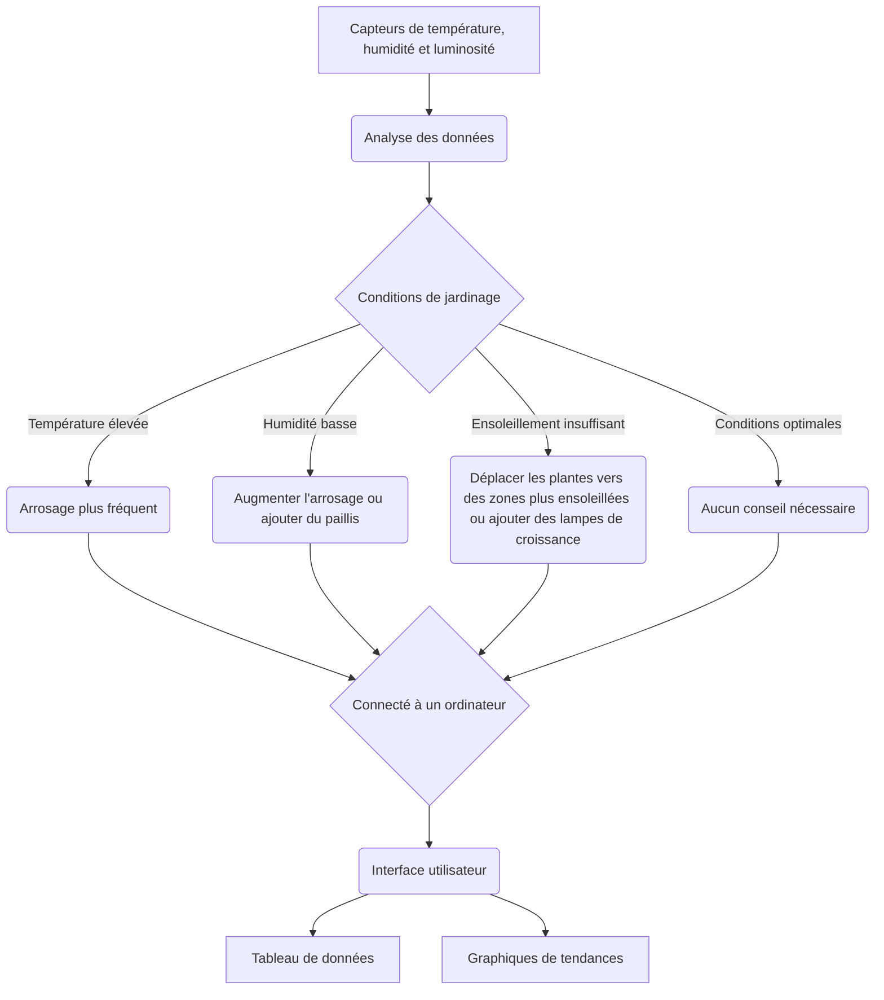

# AgriMapBot 🌾

## À propos du projet

&nbsp;&nbsp;&nbsp;&nbsp;&nbsp;&nbsp;&nbsp;&nbsp;**AgriMapBot 🌾** est un robot conçu pour cartographier les plantations en mesurant la température, l'humidité et l'ensoleillement. Ces données lui permettent de fournir des conseils pour optimiser la croissance et la santé des plantes.

 

## Sommaire

[I. Qui sommes-nous ?](#i-qui-sommes-nous-)

[II. Pourquoi ce projet ?](#ii-pourquoi-ce-projet-)

[III. Fonctionnalités](#iii-fonctionnalités)

[IV. Liste du matériel du projet final](#iv-liste-du-matériel-du-projet-final)

[V. Installation du projet final](#v-installation-du-projet-final)

[VI. Notre parcours](#vi-notre-parcours)

[VII. Licence](#vii-licence)

[VIII. Contacts](#viii-contacts)

[IX. Contributions](#ix-contributions)

[X. Remerciements](#x-remerciements)

## I. Qui sommes-nous ?

Nous sommes un groupe de 4 étudiants passionnés, inscrits en classe préparatoire au cycle ingénieur à ESEO - Cours Lumière, située au Togo. L'équipe est constituée de GNASSINGBE Émilie, DOUMBIA Aïchata, KORDOHOU Errath et LEENAERTS Loïc (chef de projet). 

## II. Pourquoi ce projet ?

Inspirée par l'événement mondial Arduino Day, notre équipe a saisi l'opportunité offerte par nos enseignants de concevoir des projets de robotique. Nous aspirons à améliorer la culture des plantes et à encourager l'utilisation de la tech pour faciliter et optimiser l'agriculture sur notre continent.

## III. Fonctionnalités

- **Prise en charge de formes de jardins quelconques**
- **Cartographie thermique**
- **Cartographie de l'humidité**
- **Cartographie de l'ensoleillement**
- **Conseils de jardinage**

## IV. Liste du matériel du projet final

| **Système**             | **Arduino**                            | **Espressif**                                                    |
|-------------------------|----------------------------------------|------------------------------------------------------------------|
| 🖥️ **Microcontrôleur** | Arduino NANO                           | ESP-32-CAM                                                       |
| 📡 **Capteurs**         | - 🌡️💧DHT22 × 1                       | - 🌡️💧DHT22 × 1                                                 |
|                         | - 🌅 Photorésistance × 1               | - 🌅 Photorésistance × 1                                         |
|                         | - 🔊 Capteur ultrason × 3              | - 🔊 Capteur ultrason × 3                                        |
|                         | - 📷 Module caméra                     |                                                                  |
|                         | - 🌍 Module GPS                        | - 🌍 Module GPS                                                  |
| 🛠️ **Autres**          | - ⚙️ Servomoteurs débridés × 4~6       | - ⚙️ Servomoteurs débridés × 4~6 (dépendant de la charge totale) |
|                         | - 🔋 Batterie : rechargeable et légère | - 🔋 Batterie : rechargeable et légère                           |
|                         | - 🛡️ Châssis : PLA                    | - 🛡️ Châssis : PLA                                              |

## V. Installation du projet final
😶‍🌫️

## VI. Notre parcours

Le projet final implique un robot entièrement autonome, capable de cartographier un jardin de forme complexe. Mais avant d'atteindre ce résultat final, nous devons adopter une méthode itérative. Ainsi, dans un premier temps, le projet se limitera à ces fonctionnalités :

- **Prise en charge de formes de jardins rectangulaires**
- **Cartographie thermique**
- **Cartographie de l'humidité**
- **Cartographie de l'ensoleillement**

Nous avons eu à réaliser le schéma que voici pour avoir une idée de la forme du robot et de l'emplacement des capteurs et composants pour optimiser l'espace efficacement afin d'accueillir l'ensemble du câblage. 

- Nous avons donc placé le [🌡️💧DHT22](https://grabcad.com/library/dht22-module-1) tourné vers le sol et sur la face inférieure du robot pour pouvoir prendre nos mesures le plus près possible du sol. 
- Les 4 [⚙️Servomoteur](https://grabcad.com/library/servo-motor-sg90-6) et les 3 [🔊Capteur ultrason](https://grabcad.com/library/ultrasonic-sensor-hc-sr04-3) ont eux, étés logés sur les côtés symétriquement par rapport à l'axe passant par le milieu des faces inférieur et supérieur. 
- La [🌅 Photorésistance](https://grabcad.com/library/gl5528-photoresistor-1) est quant à elle placée de sorte que le milieu de sa face supérieur soit confondus avec l'axe de symétrie. 
- L'antenne du [🌍 Module GPS](https://grabcad.com/library/ublox-m6-with-ceramic-antenna-1) a été placée au-dessus de l'[🖥️Arduino NANO](https://grabcad.com/library/arduino-nano--1) pour des raisons d'esthétiques. 
- La carte [🖥️Arduino NANO](https://grabcad.com/library/arduino-nano--1) est elle-même placée de telle sorte que ces ports soient exposés et facilement accéssibles de l'extérieur.

 
 
Voici les étapes de la modélisation du corps de notre robot :
 
 <video autoplay loop playsinline src="https://github.com/THE07s/GardenMapBot/assets/101391118/6161aa29-c9dc-4e73-8f62-6bf7b1b91bbf">  video </video>
 

Voici les différentes parties qui forment le boitier de notre robot :
 

    
    

Voici un aperçu du déplacement du robot :

 
<video autoplay loop playsinline src="https://github.com/THE07s/GardenMapBot/assets/162814002/8494161b-c6f6-4778-b160-64e97f9adee7" width="30%" hspace="10"> video </video>
 

> [!NOTE]
> ### Problèmes & Solutions
> Lors de la réalisation de ce projet, nous avons eu à faire face à une flopée de problèmes à savoir :
> **Pendant la modélisation 3D** :
> - Centrer les extrusions (destinées à la carte) horizontalement au milieu de la face réservée en utilisant la modélisation paramétrique.
> - Établir une connexion claire entre les esquisses et la modélisation 3D.
> - Éviter les sur-contraintes de l’esquisse.

> [!WARNING]
> **Après la modélisation 3D** :
> - Le DHT22 et le module GPS ne rentraient pas dans l'espace qui leur était réservés.
> - Les Servomoteurs flottaient dans l'espace qui leur était réservés.

> [!NOTE]
> **Pendant la conception du circuit** :
> - Importer le DHT22 dans Fritzing.
> - Importer le Shield adapté à l'Arduino NANO dans Fritzing.
> - L'absence du NANO, du module GPS et du DHT22 dans Tinkercad.

> [!TIP]
> Pour résoudre ces problèmes, nous avons "innover" et fait les tests nécessaires avec l'Arduino UNO étant donné les nombreuses similitudes entre cette carte et l'arduino NANO. Quant aux pièces, nous avons limé les contours pour pouvoir placer le DHT22 et utiliser le pistolet à colle pour fixer les servomoteurs.

### Références

- [Inspiration pour la conception du corps 🧰](https://www.youtube.com/watch?v=E0NVC8xhf3I)
- [Roues pour le servomoteur SG90 ⚙️](https://cults3d.com/fr/mod%C3%A8le-3d/art/wheel-for-sg90-servo)
- [Configuration du capteur ultrason 🔊](https://arduino-france.site/ultrason-hc-sr04/)
- [Aide à la rédaction de la documentation 📑](https://github.com/miyujach/Projet-Robot/blob/9f384fafb67974cea4fc9b659ff7004661033b75/README.md#projet-ascyloom)
